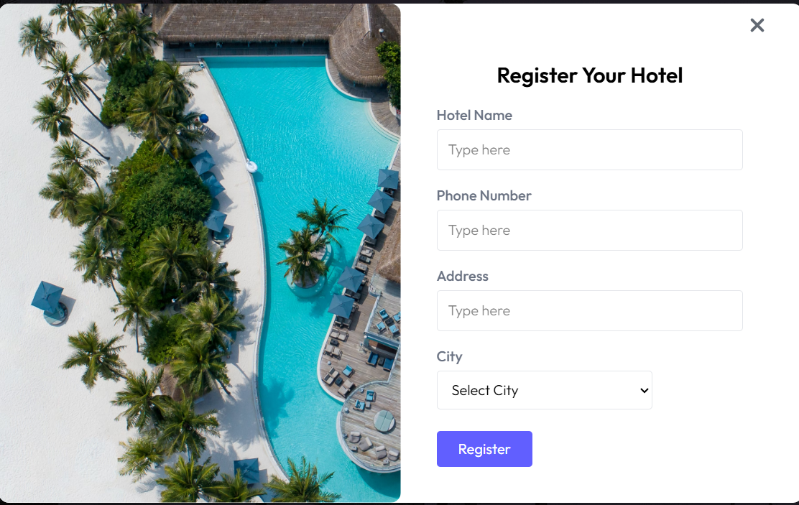
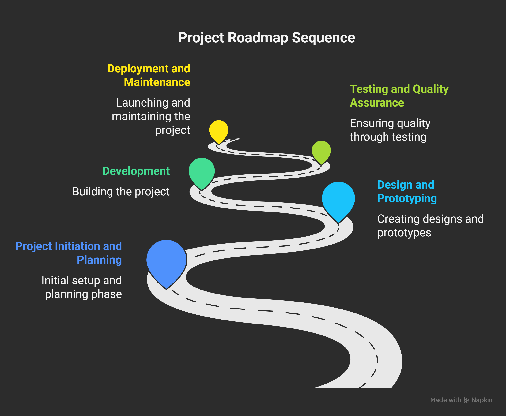
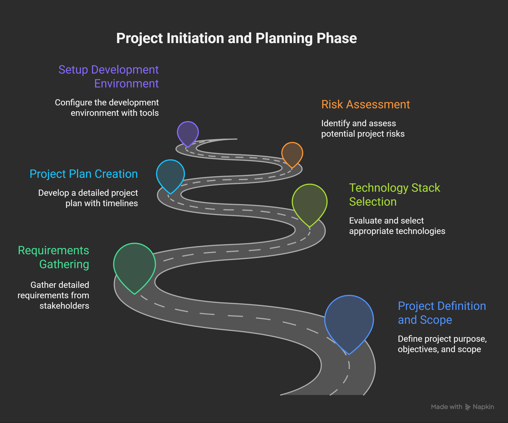
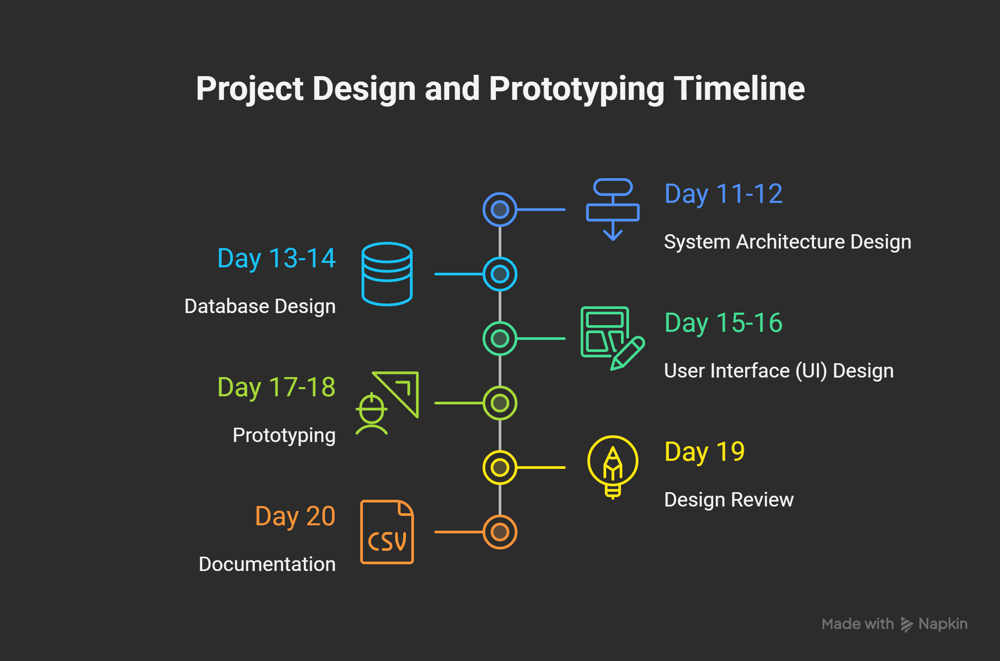

# 🏨 ShayanKaksh 

An advanced Hotel & Room Booking Platform built with production-grade standards, scalability in mind, and modern industry practices in full-stack development, cloud deployment, and payment integration.


## **Project Philosophy**

From an architectural standpoint, this project emphasizes:

  - Separation of Concerns: A distinct front-end client and back-end API ensure modularity, independent scalability, and easier maintenance.

   - State-of-the-Art Technology: Utilization of modern JavaScript frameworks (React and Node.js) to build a fast, responsive, and efficient single-page application (SPA).

  - Secure by Design: Implementation of best practices for authentication (JWT), data validation, and secure API communication.


## **Live Demo**

  - Frontend Application: https://shayan-kaksh.vercel.app/ (e.g., Vercel, Netlify)

  - Backend API Endpoint: https://shayan-kaksh-backend.vercel.app/
## **🚀 Features**

 **👤User Functionality**
 -

   - **Secure Authentication:** Powered by Clerk for modern and secure identity management.
- **Dynamic Room Catalog:** Browse all available rooms with high-resolution imagery, detailed descriptions, and pricing.

- **Advanced Search & Filtering:** Filter accommodations by date availability, price range, room type, and amenities.

- **Seamless Booking Process:** An intuitive multi-step booking form to select dates and confirm reservations.

- **Personal Dashboard:** Registered users can view and manage their upcoming and past bookings.

**📊Administrative Panel**

  - **Property Management:** CRUD operations for room listings (Create, Read, Update, Delete).

- **Booking Oversight:** View all system-wide reservations and manage their status (e.g., confirm, cancel).

- **User Management:** Ability to view and manage registered user accounts.


**🏨Hotel & Room Management** 

  
  - Add, update, and manage hotel listings with rich details.


**📅 Booking System** 
- Real-time availability & seamless booking experience.

**💳 Stripe Payment Integration**

 - Secure and reliable payment gateway with webhook support.


**☁️ Cloudinary Integration** 
 
 - For image uploads and optimization.

**📧 Email Notifications**
 - Automatic notifications on booking confirmation, cancellation, and updates.


**📱 Responsive Design**
 - Optimized for mobile, tablet, and desktop.
## **🛠️ Technology Stack**

| Category       | Technology               | Description                                                                 |
|----------------|--------------------------|-----------------------------------------------------------------------------|
| 🖥️ Frontend    | React.js ⚛️              | A declarative JavaScript library for building dynamic user interfaces.      |
| 🖥️ Frontend    | Tailwind CSS 🎨          | Utility-first CSS framework for building modern, responsive UIs.            |
| 🖥️ Frontend    | Redux Toolkit ⚡         | State management library for predictable and efficient app state handling.  |
| 🖥️ Frontend    | Vite ⚡                  | Next-generation frontend tooling for fast builds and development.           |
| 🖥️ Frontend    | Framer Motion ✨         | Library for smooth animations and interactive UI transitions.               |
| 🛠️ Backend     | Node.js 🚀               | JavaScript runtime environment for server-side logic.                       |
| 🛠️ Backend     | Express.js ⚙️            | Minimalist web framework for building RESTful APIs with Node.js.            |
| 🔐 Auth        | Clerk 🔑                 | Authentication & user management with prebuilt UI components and APIs.      |
| 🗄️ Database    | MongoDB 🍃               | NoSQL database for scalable, flexible, document-oriented data storage.      |
| 🗄️ Database    | Mongoose ODM             | Elegant object modeling library for MongoDB and Node.js.                    |
| 💳 Payments    | Stripe API 💳            | Secure payment processing and subscription management.                      |
| ☁️ Media       | Cloudinary ☁️            | Cloud-based service for image and video storage, optimization, and delivery.|
| 🚀 Deployment  | Vercel / Netlify         | Platforms for hosting frontend apps and serverless backend functions.       |


## **🔐 Authentication & Security**
- Clerk-powered authentication (Email, Social Logins)

- Session-based secure cookies

- Role-based access (User, Admin)

- Encrypted payments via Stripe
## **📂 Project Structure**

      ShayanKaksh/
      │── backend/ # Express.js backend
      │ ├── controllers/ # Business logic
      │ ├── models/ # MongoDB schemas
      │ ├── routes/ # API endpoints
      │ ├── configs/ # Database & cloud configs
      │ └── server.js # Entry point
      │
      │── frontend/ # React + Vite frontend
      │ ├── src/
      │ │ ├── components/ # UI Components
      │ │ ├── pages/ # Pages (Hotel, Room, Booking)
      │ │ ├── redux/ # Redux Toolkit store
      │ │ ├── assets/ # Images & icons
      │ │ └── App.jsx # Root component
      │
      │── .env.example # Environment variables
      │── package.json # Dependencies
      │── README.md # Documentation


## **🔄 Booking Flow Diagram**
## **🚀Getting Started**

To get a local copy up and running, follow these simple steps.

**Prerequisites**

Ensure you have the following installed on your system:

  - [Node.js](https://nodejs.org/) (v16+ recommended, comes with npm) .
- [Git](https://git-scm.com/)  
- [MongoDB](https://www.mongodb.com/) installed locally **OR** a MongoDB Atlas connection string.
- [Vercel CLI](https://vercel.com/docs/cli) (optional, if deploying). 
- [Cloudinary Account](https://cloudinary.com/) for image & video storage  
- [Clerk Account](https://clerk.com/) for authentication setup.  
- [Stripe Account](https://stripe.com/) (for payment integration). 
## **⚙️ Installation & Setup**

1.**Clone the Repository:**

```bash
    git clone https://github.com/BaljeetkumarPatel/ShayanKaksh.git
    cd ShayanKaksh
```


2.**Configure Backend Server:**

 - Navigate to the backend directory: `cd backend`

 - Install dependencies: `npm install`

 - Create a `.env` file in the backend `root.` Copy the contents of `.env.`example (if available) or add the following essential variables:

 ```bash
   cd backend

   npm install

   cp .env.example .env # Configure environment variables

   npm run server (nodemon server)

   # Database Configuration
   MONGO_URI=your_mongodb_connection_string

   # Authentication Configuration
   Clerk

   # Server Port
   PORT=5000
```

- Start the development server: npm start

  -  The backend server will be running on `http://localhost:8080`


3.**Configure Frontend Client:**

- Open a new terminal window and navigate to the frontend directory: `cd frontend`

- Install dependencies: `npm install`

- Create a `.env` file in the frontend root to specify the backend API URL:

- Start the development server: `npm run dev`

  - The React application will open automatically in your browser at `http://localhost:5173`


## **🔑 Environment Variables**

**Backend**  `.env`

```bash
# MongoDB
MONGO_URI=your_mongodb_connection_string

# Stripe (Payments)
STRIPE_SECRET_KEY=your_stripe_secret
STRIPE_PUBLISHABLE_KEY=your_stripe_publishable_key
STRIPE_WEBHOOK_SECRET=your_webhook_secret

# Cloudinary (Media Storage)
CLOUDINARY_CLOUD_NAME=your_cloudinary_name
CLOUDINARY_API_KEY=your_cloudinary_key
CLOUDINARY_API_SECRET=your_cloudinary_secret

# Clerk (Authentication)
CLERK_API_KEY=your_clerk_api_key
CLERK_PUBLISHABLE_KEY=your_clerk_publishable_key
CLERK_SECRET_KEY=your_clerk_secret_key
CLERK_WEBHOOK_SECRET=your_clerk_webhook_secret

# Email (SMTP)
SENDER_EMAIL=your_sender_email
SMTP_USER=your_smtp_username
SMTP_PASS=your_smtp_password
```

**Frontend** `.env`

```bash
# Backend API URL
VITE_BACKEND_URL=https://shayan-kaksh-backend.vercel.app

# Clerk (Frontend API)
VITE_CLERK_FRONTEND_API=your_clerk_frontend_api

# Currency (for Stripe / payments)
VITE_CURRENCY=INR

# EmailJS (for notifications/emails)
EMAIL_JS_PUBLIC_KEY=your_emailjs_public_key
TEMPLATE_KEY=your_emailjs_template_key
SERVICE_KEY=your_emailjs_service_key
```
## **💳 Stripe Integration**

- Checkout Flow with dynamic pricing

- Webhook Support for payment confirmation & refunds

- PCI-Compliant secure transactions
## **📸 Screenshots**





## **📌 Roadmap**

- **Project Roadmap Sequence**
  

- **Project Initiation and Planning Phase**
  

- **Project Design and Prototyping Timeline**
  

- **Development**
  
- **Testing and Quality Assurance**
  
- **Deployment and Maintenance**
  

## API Reference

## 🧑‍💻 Users API

| Method | Endpoint        | Description            | Auth Required |
|--------|----------------|-----------------------|---------------|
| POST   | /users/register | Register a new user    | No            |
| POST   | /users/login    | User login            | Yes            |
| GET    | /users/:id      | Get user details by ID| Yes           |
| PUT    | /users/:id      | Update user details   | Yes           |
| DELETE | /users/:id      | Delete a user account | Yes           |


## 🏨 Hotels API

| Method | Endpoint       | Description              | Auth Required |
|--------|----------------|--------------------------|---------------|
| GET    | /hotels        | Get all hotels           | No            |
| GET    | /hotels/:id    | Get hotel details by ID  | No            |
| POST   | /hotels        | Add new hotel            | Yes           |
| PUT    | /hotels/:id    | Update hotel info        | Yes           |
| DELETE | /hotels/:id    | Delete hotel             | Yes           |


## 🛏️ Rooms API

| Method | Endpoint       | Description           | Auth Required |
|--------|----------------|---------------------|---------------|
| GET    | /rooms         | Get all rooms        | No            |
| GET    | /rooms/:id     | Get room details by ID | No          |
| POST   | /rooms         | Add new room         | Yes           |
| PUT    | /rooms/:id     | Update room info     | Yes           |
| DELETE | /rooms/:id     | Delete room          | Yes           |

## 📖 Bookings API

| Method | Endpoint        | Description            | Auth Required |
|--------|----------------|-----------------------|---------------|
| GET    | /bookings       | Get all bookings      | Yes           |
| GET    | /bookings/:id   | Get booking by ID     | Yes           |
| POST   | /bookings       | Create a new booking  | Yes           |
| PUT    | /bookings/:id   | Update booking details| Yes           |
| DELETE | /bookings/:id   | Cancel booking        | Yes           |

## 💳 Stripe Webhooks API

| Method | Endpoint          | Description                 | Auth Required |
|--------|-----------------|-----------------------------|---------------|
| POST   | /stripe/webhook  | Receive payment notifications | No            |


## **🤝 Contribution**

Contributions are always welcome!🚀

- Fork the repo

- Create a new branch (feature-xyz)

- Commit changes

- Push to branch

- Open a Pull Request

Please adhere to this project's `code of conduct`.


## 📜 License

This project is licensed under the MIT License.

## 👨‍💻 Author

**Baljeet Kumar Patel**

💼 Full Stack Developer | 🌐 Open Source Contributor | 🚀 Cloud Enthusiast

📧 baljeetpatel022@gmail.com

🔗 [GitHub Profile](https://github.com/BaljeetkumarPatel)

